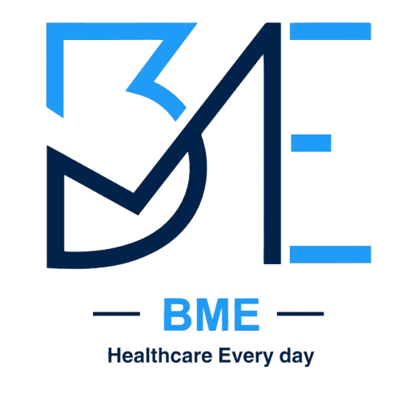

# BME Pharma Website



A modern, responsive e-commerce web application built for BME Pharma using **Next.js 16**, **TypeScript**, and **Tailwind CSS**. This project features a robust product catalog, shopping cart functionality, wishlist management, and a seamless checkout process, all wrapped in a sleek, accessible UI.

## 🚀 Features

- **Modern Tech Stack**: Built with Next.js 16 (App Router), React 19, and TypeScript.
- **Responsive Design**: Fully responsive layout optimized for mobile, tablet, and desktop.
- **UI Components**: Utilizes **Shadcn UI** for accessible and customizable components.
- **Theming**: Built-in Dark/Light mode support via `next-themes`.
- **Localization**: Bilingual support for **English** and **Arabic** (RTL support).
- **E-Commerce Functionality**:
  - **Product Catalog**: Browse products with category filtering and sorting.
  - **Product Details**: Detailed product pages with image galleries and related items.
  - **Cart & Wishlist**: Persistent cart and wishlist state using local storage.
  - **Checkout Flow**: Multi-step checkout process with shipping and payment method selection (COD, Visa, PayPal).
- **Dynamic Routing**: SEO-friendly URL structure for products and categories.
- **Toast Notifications**: Interactive feedback using `sonner`.

## 🛠️ Tech Stack

- **Framework**: [Next.js 16](https://nextjs.org/)
- **Language**: [TypeScript](https://www.typescriptlang.org/)
- **Styling**: [Tailwind CSS v4](https://tailwindcss.com/)
- **UI Library**: [Shadcn UI](https://ui.shadcn.com/) / [Radix UI](https://www.radix-ui.com/)
- **Icons**: [Lucide React](https://lucide.dev/)
- **State Management**: React Context API + Local Storage
- **Charts**: [Recharts](https://recharts.org/)
- **Carousel**: [Embla Carousel](https://www.embla-carousel.com/)

## 📦 Getting Started

### Prerequisites

- Node.js (v18+ recommended)
- npm, yarn, pnpm, or **bun** (recommended)

### Installation

1.  **Clone the repository:**

    ```bash
    git clone https://github.com/pepoo202020/bme-website.git
    cd bme-website
    ```

2.  **Install dependencies:**

    ```bash
    npm install
    # or
    yarn install
    # or
    pnpm install
    # or
    bun install
    ```

3.  **Run the development server:**

    ```bash
    npm run dev
    # or
    yarn dev
    # or
    pnpm dev
    # or
    bun dev
    ```

4.  Open [http://localhost:3000](http://localhost:3000) with your browser to see the result.

## 📂 Project Structure

```
src/
├── app/                  # Next.js App Router pages and layouts
│   ├── (marketing)/      # Public marketing pages (Home, Store, Checkout, etc.)
│   ├── (dashboard)/      # Dashboard pages (Admin/User)
│   └── layout.tsx        # Root layout
├── components/           # Reusable React components
│   ├── layout/           # Header, Footer, Sidebar
│   ├── ui/               # Shadcn UI primitives
│   ├── marketing/        # Landing page sections
│   ├── store/            # Store specific components (Grid, Filters)
│   ├── cart/             # Cart sheet and components
│   ├── wishlist/         # Wishlist sheet
│   └── checkout/         # Checkout form and steps
├── context/              # React Context providers (Store, Currency, Language)
├── data/                 # Static data and mock content
├── lib/                  # Utility functions
└── types/                # TypeScript interfaces and types
```

## 📜 Scripts

- `dev`: Starts the development server.
- `build`: Builds the application for production.
- `start`: Runs the built production application.
- `lint`: Runs ESLint to catch code quality issues.

## 🤝 Contributing

Contributions are welcome! Please feel free to submit a Pull Request.

1.  Fork the project
2.  Create your feature branch (`git checkout -b feature/AmazingFeature`)
3.  Commit your changes (`git commit -m 'Add some AmazingFeature'`)
4.  Push to the branch (`git push origin feature/AmazingFeature`)
5.  Open a Pull Request

## 📄 License

This project is licensed under the MIT License - see the [LICENSE](LICENSE) file for details.
